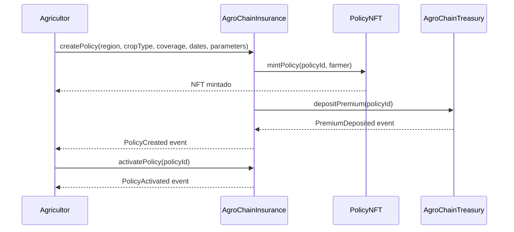
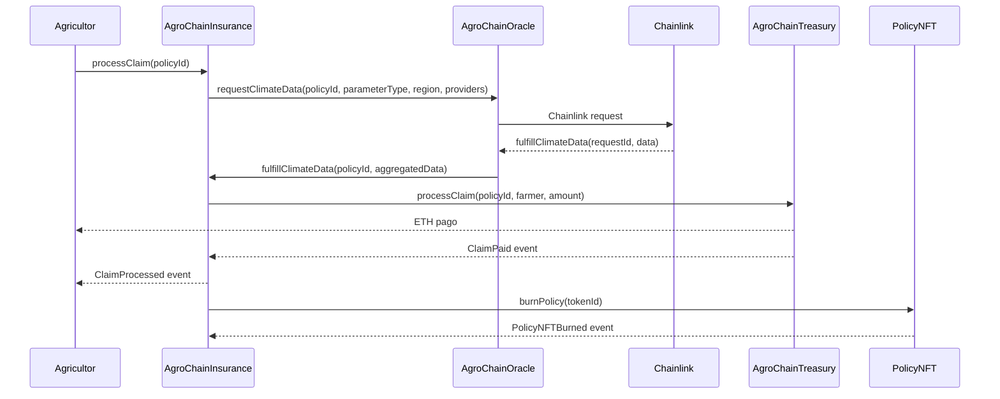

# Regras de Negócio do AgroChain

## 1. **Criação e Gestão de Apólices de Seguro**

- **Criação de Apólice** (`AgroChainInsurance`):
  - **Regiões e Culturas Suportadas**: Apólices só podem ser criadas para regiões (ex.: Bahia, Mato Grosso, Paraná) e culturas (ex.: soja, milho, café) previamente registradas pelo contrato (`addSupportedRegion`, `addSupportedCrop`).
  - **Parâmetros Climáticos**: Cada apólice é associada a parâmetros climáticos específicos (ex.: precipitação, temperatura), definidos pelo agricultor no momento da criação (`createPolicy`).
  - **Período de Cobertura**: Apólices têm datas de início e término, com cobertura válida apenas durante esse período.
  - **Prêmio**: O agricultor deve pagar um prêmio (em ETH) calculado com base no valor de cobertura (`coverageAmount`) e na taxa de prêmio (`premiumRate`, padrão 5%).
  - **Validação**: O agricultor deve ser uma pessoa física (`!isContract`), a região e cultura devem ser suportadas, e o pagamento do prêmio deve ser suficiente.
- **Tokenização como NFT** (`PolicyNFT`):
  - Cada apólice é representada por um NFT ERC-721, mintado pelo contrato `PolicyNFT` ao criar a apólice.
  - O NFT contém metadados on-chain (região, tipo de cultura, cobertura, datas, prêmio, parâmetros climáticos).
  - NFTs podem ser transferidos, permitindo negociação em mercados secundários.
  - NFTs são queimados (`burnPolicy`) quando a apólice expira ou é totalmente reclamada.
- **Ativação de Apólice** (`AgroChainInsurance`):
  - Apólices criadas entram em estado "Pendente" e só são ativadas após o agricultor pagar o prêmio total (`activatePolicy`).
  - O prazo para ativação é de 1 dia após a criação; caso contrário, a apólice é cancelada, e o agricultor pode solicitar reembolso.

## 2. **Processamento de Sinistros**

- **Acionamento Paramétrico** (`AgroChainInsurance`, `AgroChainOracle`):
  - Sinistros são acionados automaticamente com base em dados climáticos fornecidos pelo `AgroChainOracle`, que consulta múltiplos provedores de dados via Chainlink.
  - O contrato verifica se os dados climáticos (ex.: precipitação abaixo do limite) atendem aos gatilhos da apólice (`processClaim`).
  - Dados climáticos são agregados de pelo menos 3 provedores, usando a mediana para consenso (`aggregateData` em `AgroChainOracle`).
- **Pagamento de Sinistros** (`AgroChainTreasury`):
  - Sinistros aprovados são pagos do pool de sinistros da tesouraria ao agricultor.
  - O valor pago é limitado ao `coverageAmount` da apólice.
  - Após o pagamento total, o NFT associado pode ser queimado.
- **Validação**:
  - Apenas apólices ativas e dentro do período de cobertura podem ter sinistros processados.
  - O processamento só ocorre após a resposta do oráculo (`fulfillClimateData`).

## 3. **Gestão Financeira (Tesouraria)**

- **Alocação de Prêmios** (`AgroChainTreasury`):
  - Prêmios pagos pelos agricultores são divididos:
    - **70%** para o pool de sinistros (reserva para pagar reivindicações).
    - **20%** para o pool de rendimento (investido para gerar lucros).
    - **10%** para taxas operacionais.
  - Depósitos são registrados via `depositPremium`, com eventos para rastreamento.
- **Pagamentos e Reembolsos**:
  - Sinistros são pagos do pool de sinistros (`processClaim`).
  - Reembolsos para apólices canceladas ou não ativadas são pagos do pool de prêmios (`processRefund`).
- **Saúde Financeira**:
  - A tesouraria mantém indicadores financeiros (`getFinancialHealth`):
    - **Solvência**: Razão entre ativos totais e passivos.
    - **Reserva**: Razão entre reservas de sinistros e cobertura total.
    - **Liquidez**: Razão entre ativos líquidos e passivos de curto prazo.
  - O rebalanceamento dos pools ocorre periodicamente para manter a solvência (`rebalanceRiskPool`).
- **Geração de Rendimento**:
  - O pool de rendimento pode ser investido em estratégias externas (ex.: DeFi), com lucros registrados via `YieldGenerated`.

## 4. **Governança Descentralizada**

- **Governança via Token AGRO** (`AgroChainGovernance`, `ConcreteAgroChainGovernance`, `AgroChainToken`):
  - O token AGRO (ERC-20) é usado para votação em propostas de governança.
  - Holders de AGRO com pelo menos 1.000 tokens (`proposalThreshold`) podem criar propostas.
  - Propostas exigem um quórum de 10% dos tokens em circulação (`quorumThreshold`) para serem aprovadas.
- **Ciclo de Propostas**:
  - **Período de Votação**: 3 dias para votação (`votingPeriod`).
  - **Delay de Execução**: 1 dia após aprovação para executar a proposta (`executionDelay`).
  - Propostas podem alterar parâmetros do sistema (ex.: taxas, regiões suportadas) ou atualizar contratos.
- **Gestão de Tokens**:
  - Fornecimento inicial de 1M AGRO, com cap máximo de 100M AGRO.
  - Tokens podem ser mintados ou queimados sob controle da governança.

## 5. **Integração com Oráculos**

- **Consulta de Dados Climáticos** (`AgroChainOracle`):
  - O oráculo solicita dados climáticos de múltiplos provedores via Chainlink (`requestClimateData`).
  - Cada solicitação tem um `requestId` único, mapeado para o `policyId`.
  - A taxa de Chainlink (0.1 ETH) é paga pela tesouraria.
- **Consenso de Dados**:
  - Dados de pelo menos 3 provedores são agregados, usando a mediana para evitar manipulação.
  - Respostas fora de um intervalo aceitável são descartadas (`aggregateData`).
- **Fallback**:
  - Se o oráculo falhar (ex.: menos de 3 respostas), o sistema pode pausar operações ou usar dados alternativos, sujeito à governança.

## 6. **Segurança e Administração**

- **Pausabilidade**:
  - Contratos como `AgroChainInsurance`, `AgroChainTreasury`, e `PolicyNFT` podem ser pausados pelo proprietário ou governança em emergências, suspendendo funções críticas (ex.: transferências de NFTs, pagamentos).
- **Acesso Restrito**:
  - Funções sensíveis (ex.: `mintPolicy`, `processClaim`) são restritas ao contrato `AgroChainInsurance` ou ao proprietário/governança.
  - A tesouraria só permite retiradas de capital sob aprovação da governança.
- **Atualizabilidade**:
  - Contratos usam proxies transparentes (via `AgroChainFactory`) para permitir atualizações sem perda de estado.
  - Atualizações são propostas e aprovadas via governança.
- **Eventos**:
  - Todas as ações principais (depósito de prêmios, pagamento de sinistros, criação de NFTs, votação) emitem eventos para transparência e rastreamento.

## 7. **Interação com Usuários**

- **Agricultores**:
  - Criam apólices, pagam prêmios, e recebem NFTs representando suas coberturas.
  - Podem solicitar sinistros automaticamente com base em gatilhos climáticos.
  - Podem negociar NFTs em mercados secundários.
- **Investidores/Governança**:
  - Holders de AGRO participam da governança, votando em propostas.
  - Podem propor mudanças no sistema (ex.: novas regiões, ajustes de taxas).
- **Administradores**:
  - Inicialmente, o proprietário (definido no deploy) pode configurar regiões, culturas, e pausar contratos.
  - A governança assume o controle a longo prazo, reduzindo centralização.

## 8. **Testes e Simulação**

- **Mocks** (`MockDataProvider`, `MockTreasury`, `MockOracle`):
  - Permitem testar o sistema sem dependência de Chainlink ou transferências reais de ETH.
  - Simulam provedores de dados, tesouraria, e oráculos, com respostas configuráveis.
- **Indicadores de Teste**:
  - `MockTreasury` simula saúde financeira (ex.: 150% solvência, 120% reserva) e exposição ao risco (ex.: 500 ETH, 3 apólices ativas).
  - `MockOracle` gera `requestId` determinísticos para rastreamento.

## 9. **Implantação**

- **Deploy** (`Deploy.s.sol`):
  - Implanta todos os contratos com configurações iniciais:
    - Token AGRO com 1M de fornecimento inicial.
    - Governança com votação de 3 dias, delay de 1 dia, quórum de 10%.
    - Oráculo com taxa Chainlink de 0.1 ETH.
    - Regiões e culturas predefinidas.
  - Conecta contratos (ex.: `AgroChainInsurance` com oráculo e tesouraria).
- **Arquitetura Atualizável**:
  - O `AgroChainFactory` implanta contratos com proxies transparentes, mas o `Deploy.s.sol` atual não o utiliza, sugerindo que é voltado para testes.

### Resumo das Regras de Negócio

O AgroChain é um sistema de seguro paramétrico agrícola que:

1. Permite que agricultores criem apólices para culturas e regiões específicas, pagando prêmios calculados automaticamente.
2. Tokeniza apólices como NFTs negociáveis, com metadados on-chain.
3. Processa sinistros automaticamente com base em dados climáticos de oráculos Chainlink, usando consenso de múltiplos provedores.
4. Gerencia fundos via tesouraria, alocando prêmios em pools de sinistros, rendimento, e taxas, com rebalanceamento periódico.
5. Oferece governança descentralizada via token AGRO, permitindo que holders votem em mudanças no sistema.
6. Garante segurança com pausabilidade, acesso restrito, e proxies atualizáveis.
7. Suporta testes com mocks para simular oráculos, tesouraria, e provedores de dados.

### Possíveis Lacunas nas Regras de Negócio

1. **Expiração de Apólices**:
   - Não há uma regra clara para queimar NFTs de apólices expiradas automaticamente. Isso pode ser uma decisão de design, mas pode levar a NFTs "órfãos".
2. **Gestão de Falhas do Oráculo**:
   - Se o oráculo não fornecer dados suficientes (ex.: menos de 3 respostas), não há um mecanismo de fallback claro, exceto pausar o sistema.
3. **Taxas Dinâmicas**:
   - A taxa de prêmio é fixa em 5%. Poderia ser ajustável por região/cultura via governança para refletir riscos diferentes.
4. **Mercado Secundário de NFTs**:
   - Embora os NFTs sejam negociáveis, não há regras específicas para limitar transferências (ex.: apenas para agricultores verificados) ou integrar com mercados externos.

### Sugestões para Refinar as Regras

1. **Automação de Expiração**:
   - Adicionar uma função em `AgroChainInsurance` para verificar apólices expiradas e queimar seus NFTs automaticamente.
2. **Fallback para Oráculos**:
   - Definir uma regra para usar fontes alternativas de dados ou pausar sinistros se o oráculo falhar, com votação da governança para resolver disputas.
3. **Taxas Dinâmicas**:
   - Permitir que a governança ajuste `premiumRate` por região/cultura com base em dados históricos de sinistros.
4. **Restrições de Transferência de NFTs**:
   - Adicionar verificações em `PolicyNFT` para limitar transferências a endereços aprovados (ex.: agricultores registrados).

### Diagrama do Fluxo de Apólices e Sinistros (AgroChain)

#### Visão Geral

O sistema AgroChain envolve interações entre o agricultor, os contratos `AgroChainInsurance`, `PolicyNFT`, `AgroChainOracle`, e `AgroChainTreasury`, com governança via `AgroChainGovernance`. O fluxo de apólices cria um NFT representando a cobertura, enquanto o fluxo de sinistros processa reivindicações com base em dados climáticos.

#### Formato do Diagrama

- **ASCII**: Usarei uma representação textual simples com setas (`-->`, `<--`) para indicar o fluxo.
- **Descrição**: Cada etapa será explicada em detalhes, incluindo contratos envolvidos, funções chamadas, e regras de negócio.
- **Legenda**:
  - **A**: Agricultor (usuário externo).
  - **AI**: `AgroChainInsurance` (contrato principal de seguro).
  - **PN**: `PolicyNFT` (contrato de tokenização de apólices).
  - **AO**: `AgroChainOracle` (oráculo para dados climáticos).
  - **AT**: `AgroChainTreasury` (tesouraria para gestão financeira).
  - **CL**: Chainlink (rede externa de oráculos, simulada por `MockDataProvider` em testes).

---

### 1. Fluxo de Criação de Apólices

**Descrição**: O agricultor cria uma apólice de seguro, paga o prêmio, e recebe um NFT representando a cobertura. O processo envolve validação, tokenização, e depósito na tesouraria.

**Diagrama ASCII**:

'''
A --> AI: createPolicy(region, cropType, coverage, dates, parameters)
      |
      v
AI --> PN: mintPolicy(policyId, farmer)
      |
      v
AI --> AT: depositPremium(policyId)
      |
      v
A <-- AI: PolicyCreated event
A <-- PN: PolicyTokenized event
'''

**Etapas Detalhadas**:

1. **Solicitação de Apólice**:
   - **Ator**: Agricultor (A).
   - **Contrato**: `AgroChainInsurance` (AI).
   - **Função**: `createPolicy(string memory region, string memory cropType, uint256 coverageAmount, uint256 startDate, uint256 endDate, string memory climateParameters, uint256 premiumRate)`.
   - **Regras**:
     - `region` e `cropType` devem estar na lista de suportados (`supportedRegions`, `supportedCrops`).
     - `msg.sender` (agricultor) não pode ser um contrato (`!isContract`).
     - `premiumRate` é fixo em 5% (500 pontos base), e o prêmio é calculado como `coverageAmount * premiumRate / 10000`.
     - O agricultor deve enviar o valor do prêmio (`msg.value >= premium`).
   - **Ação**:
     - Cria uma apólice com estado `Pending` e emite o evento `PolicyCreated(policyId, farmer, coverageAmount, premium)`.
     - Armazena detalhes da apólice em `policies[policyId]`.

2. **Tokenização da Apólice**:
   - **Contrato**: `PolicyNFT` (PN).
   - **Função**: `mintPolicy(uint256 policyId, address to)` (chamada por AI).
   - **Regras**:
     - Apenas `AgroChainInsurance` pode chamar (`onlyInsurance`).
     - O `policyId` não pode já estar tokenizado (`PolicyAlreadyTokenized`).
   - **Ação**:
     - Minta um NFT (ERC-721) com um novo `tokenId`.
     - Mapeia `policyId` para `tokenId` (`_policyIdToTokenId`) e vice-versa.
     - Define metadados do NFT via `setMetadata` (região, cultura, cobertura, etc.), gerando URI on-chain em Base64.
     - Transfere o NFT para o agricultor (`to`).
     - Emite `PolicyTokenized(policyId, tokenId, to)`.

3. **Depósito do Prêmio**:
   - **Contrato**: `AgroChainTreasury` (AT).
   - **Função**: `depositPremium(uint256 policyId)` (chamada por AI).
   - **Regras**:
     - O valor do prêmio (`msg.value`) é enviado para a tesouraria.
     - O prêmio é alocado: 70% para pool de sinistros, 20% para rendimento, 10% para taxas.
   - **Ação**:
     - Registra o depósito e emite `PremiumDeposited(policyId, amount)`.

4. **Ativação da Apólice**:
   - **Contrato**: `AgroChainInsurance` (AI).
   - **Função**: `activatePolicy(uint256 policyId)` (chamada pelo agricultor).
   - **Regras**:
     - Deve ser chamada dentro de 1 dia após a criação (`block.timestamp < policies[policyId].createdAt + 1 days`).
     - A apólice deve estar no estado `Pending`.
   - **Ação**:
     - Altera o estado da apólice para `Active`.
     - Emite `PolicyActivated(policyId)`.

5. **Cancelamento (Opcional)**:
   - **Contrato**: `AgroChainInsurance` (AI).
   - **Função**: `cancelPolicy(uint256 policyId)` (chamada pelo agricultor).
   - **Regras**:
     - Só pode ser cancelada se estiver `Pending` e antes da data de início (`block.timestamp < startDate`).
   - **Ação**:
     - Reembolsa o prêmio via `AgroChainTreasury.processRefund`.
     - Emite `PolicyCancelled(policyId)` e `RefundProcessed(policyId, farmer, amount)`.

---

### 2. Fluxo de Sinistros

**Descrição**: Um sinistro é acionado quando dados climáticos indicam que os gatilhos da apólice foram atendidos (ex.: precipitação abaixo do limite). O processo envolve solicitação de dados ao oráculo, agregação de respostas, e pagamento do sinistro.

**Diagrama ASCII**:

'''
A --> AI: processClaim(policyId)
      |
      v
AI --> AO: requestClimateData(policyId, parameterType, region, providers)
      |
      v
AO --> CL: Chainlink request (jobId, fee)
      |
      v
CL --> AO: fulfillClimateData(requestId, data)
      |
      v
AO --> AI: fulfillClimateData(policyId, aggregatedData)
      |
      v
AI --> AT: processClaim(policyId, farmer, amount)
      |
      v
A <-- AT: ClaimPaid event
A <-- AI: ClaimProcessed event
A <-- PN: PolicyNFTBurned event (se cobertura total)
'''

**Etapas Detalhadas**:

1. **Solicitação de Sinistro**:
   - **Ator**: Agricultor (A).
   - **Contrato**: `AgroChainInsurance` (AI).
   - **Função**: `processClaim(uint256 policyId)`.
   - **Regras**:
     - A apólice deve estar `Active` e dentro do período de cobertura (`startDate <= block.timestamp <= endDate`).
     - O agricultor deve ser o proprietário da apólice (`policies[policyId].farmer == msg.sender`).
   - **Ação**:
     - Mapeia o `policyId` para um `requestId` (`policyToRequestId`).
     - Chama `AgroChainOracle.requestClimateData`.

2. **Solicitação de Dados Climáticos**:
   - **Contrato**: `AgroChainOracle` (AO).
   - **Função**: `requestClimateData(uint256 policyId, string memory parameterType, string memory region, address[] memory dataProviders)`.
   - **Regras**:
     - Requer pelo menos 3 provedores de dados (`dataProviders.length >= 3`).
     - A taxa Chainlink (0.1 ETH) é paga pela tesouraria.
   - **Ação**:
     - Gera um `requestId` e registra a solicitação (`requests[requestId]`).
     - Envia solicitação à rede Chainlink (em testes, simulada por `MockOracle`).
     - Emite `ClimateDataRequested(requestId, policyId)`.

3. **Resposta do Oráculo**:
   - **Contrato**: Chainlink (CL) → `AgroChainOracle` (AO).
   - **Função**: `fulfillClimateData(bytes32 requestId, uint256[] memory data)`.
   - **Regras**:
     - Dados são fornecidos por múltiplos provedores (mínimo 3).
     - A mediana dos dados é calculada para consenso (`aggregateData`).
     - Dados fora de um intervalo aceitável são descartados.
   - **Ação**:
     - Armazena a mediana em `climateData[requestId]`.
     - Chama `AgroChainInsurance.fulfillClimateData` com o `policyId` e o valor agregado.

4. **Processamento do Sinistro**:
   - **Contrato**: `AgroChainInsurance` (AI).
   - **Função**: `fulfillClimateData(uint256 policyId, uint256 data)`.
   - **Regras**:
     - Verifica se o `data` (ex.: precipitação) atende ao gatilho da apólice (definido em `climateParameters`).
     - Calcula o valor do sinistro (até `coverageAmount`).
   - **Ação**:
     - Se o gatilho for atendido, chama `AgroChainTreasury.processClaim`.
     - Caso contrário, rejeita o sinistro e emite `ClaimProcessed(policyId, 0, false)`.

5. **Pagamento do Sinistro**:
   - **Contrato**: `AgroChainTreasury` (AT).
   - **Função**: `processClaim(uint256 policyId, address payable recipient, uint256 amount)`.
   - **Regras**:
     - O valor é pago do pool de sinistros.
     - O pagamento é limitado ao saldo disponível e ao `coverageAmount`.
   - **Ação**:
     - Transfere ETH ao agricultor (`recipient`).
     - Emite `ClaimPaid(policyId, recipient, amount)`.

6. **Queima do NFT (Opcional)**:
   - **Contrato**: `PolicyNFT` (PN).
   - **Função**: `burnPolicy(uint256 tokenId)` (chamada por AI).
   - **Regras**:
     - Ocorre se o sinistro pagar a cobertura total ou se a apólice expirar (`block.timestamp > endDate`).
     - Apenas `AgroChainInsurance` pode chamar.
   - **Ação**:
     - Remove mapeamentos (`_policyIdToTokenId`, `_tokenIdToPolicyId`).
     - Queima o NFT e emite `PolicyNFTBurned(policyId, tokenId)`.

---

### Resumo dos Fluxos

- **Criação de Apólice**:
  1. Agricultor solicita apólice (`createPolicy`).
  2. Apólice é tokenizada como NFT (`mintPolicy`).
  3. Prêmio é depositado na tesouraria (`depositPremium`).
  4. Apólice é ativada (`activatePolicy`) ou cancelada (`cancelPolicy`).
- **Sinistro**:
  1. Agricultor solicita sinistro (`processClaim`).
  2. Oráculo solicita dados climáticos (`requestClimateData`).
  3. Chainlink fornece dados, que são agregados (`fulfillClimateData`).
  4. Sinistro é validado e pago (`processClaim`) ou rejeitado.
  5. NFT é queimado se necessário (`burnPolicy`).

---

### Observações e Sugestões

1. **Integração com `PolicyNFT`**:
   - A função `createPolicy` em `AgroChainInsurance` não chama `mintPolicy` diretamente. Verifique se isso ocorre via `AgroChainFactory` ou adicione a chamada explicitamente.
2. **Expiração Automática**:
   - Não há mecanismo para queimar NFTs de apólices expiradas automaticamente. Considere adicionar uma função em `AgroChainInsurance` para verificar apólices fora do período de cobertura.
3. **Falhas do Oráculo**:
   - Se menos de 3 provedores responderem, o sinistro pode ficar bloqueado. Adicione um fallback (ex.: votação da governança) para resolver disputas.
4. **Custo de Gás**:
   - A geração de metadados on-chain em `PolicyNFT` pode ser custosa. Considere URIs off-chain para reduzir gás, se a descentralização total não for essencial.

---

### Representação em Mermaid (Opcional)

Se você preferir um diagrama renderizável, aqui está o código em **Mermaid** para o fluxo de apólices. Você pode colá-lo em uma ferramenta como [Mermaid Live Editor](https://mermaid.live/):

Para o fluxo de sinistros:

---

### Resposta à Sua Pergunta

O diagrama acima descreve os fluxos de **criação de apólices** e **processamento de sinistros** do AgroChain, com detalhes sobre contratos, funções, e regras de negócio. Se você quiser:

- **Mais Detalhes**: Posso focar em um fluxo específico ou detalhar interações internas (ex.: agregação de dados no oráculo).
- **Formato Visual**: Posso ajustar o código Mermaid ou sugerir outra ferramenta (ex.: Lucidchart, Draw.io).
- **Testes**: Posso criar cenários de teste para validar esses fluxos com Foundry.
- **Melhorias**: Posso propor ajustes nos contratos para otimizar os fluxos (ex.: automação de expiração).

Por favor, me diga como prosseguir! Exemplo:

- "Quero o diagrama em outra ferramenta."
- "Crie testes para o fluxo de sinistros."
- "Aprofunde o fluxo de agregação de dados no oráculo."

Aguardo sua resposta!
